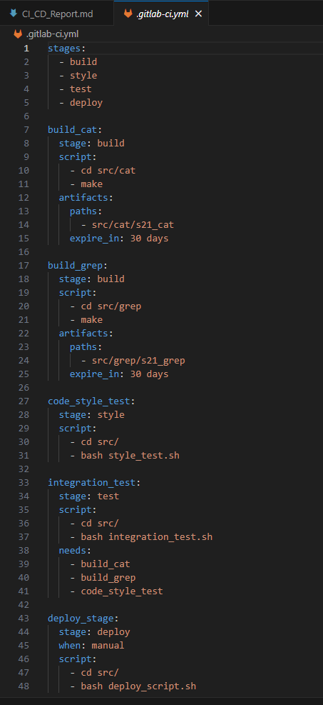

## Part 1. Setting up the gitlab-runner

### == Task ==

#### Start Ubuntu Server 22.04 LTS virtual machine.

#### Download and install gitlab-runner on the virtual machine.

Downloaded and installed gitlab-runner according to the instructions from the site:

[Installation instructions from the site](https://docs.gitlab.com/runner/install/linux-manually.html)

#### Run gitlab-runner and register it for use in the current project (DO6_CICD).

Running and register gitlab-runner according to the instructions from the site:

[Register instructions from the site](https://docs.gitlab.com/runner/register/index.html)

Register gitlab-runner(1)

Register gitlab-runner(2)

Start gitlab-runner:

gitlab-runner start

## Part 2. Building

### == Task ==

#### Write a stage for CI to build applications from the C2_SimpleBashUtils project.

Create gitlab-ci.yml file:

touch gitlab-ci.yml

Clone cat and grep utils files from out project C2 from gitlab:

cat and grep utils

##### In the gitlab-ci.yml file, add a stage to start the building via makefile from the C2 project.

##### Save post-build files (artifacts) to a random directory with a 30-day retention period.

gitlab-ci.yml file contest

#### Build testing in gitlab

##### Push our D06 directory to gitlab and test build:

Build test

## Part 3. Codestyle test

### == Task ==

#### Write a stage for CI that runs a codestyle script (clang-format).

Added style stage to the .gitlab-ci.yml file

Script for clang-format style test

#### If the codefile didn't pass, "fail" the pipeline.

#### In the pipeline, display the output of the clang-format utility.

Failed style

Failed style output

And successful style pipeline:

Successful style

Successful style output

## Part 4. Integration tests

### == Task ==

#### Write a stage for CI that runs your integration tests from the same project.

#### Run this stage automatically only if the build and codestyle test passes successfully.

Added test stage to the .gitlab-ci.yml file

Script for integration tests

#### If tests didn't pass, "fail" the pipeline.

Failed style

Failed style output

If build and/or style stages failed then failed test stage too:

Failed because build or style stage failed

Failed because build or style stage failed output

#### In the pipeline, display the output of the succeeded / failed integration tests.

Success tests

Success tests output

## Part 5. Deployment stage

### == Task ==

#### Start the second virtual machine Ubuntu Server 22.04 LTS.

Start second virtual machine

#### Local network betweem two virtual machines:

Check network and 00-installer-config.yaml

### Write a stage for CD that "deploys" the project on another virtual machine.

Deploy stage in yaml

#### Write a bash script which copies the files received after the building (artifacts) into the /usr/local/bin directory of the second virtual machine using ssh and scp.

Script for copying files

#### Proof that deploy stage has manually run:

Manually run

#### Passed all stages

All stages

## Part 6. Bonus. Notifications

### == Task ==

#### Set up notifications of successful/unsuccessful pipeline execution via bot named "[your nickname] DO6 CI/CD" in Telegram.

Some adds in .yml file

#### Created new script for sending notification about pipeline execution

Telegram notify script

#### All pipeline stages successfully passed

Successful stages

#### After successful deploy_stage bot send to us message:

Notify

### == Task ==